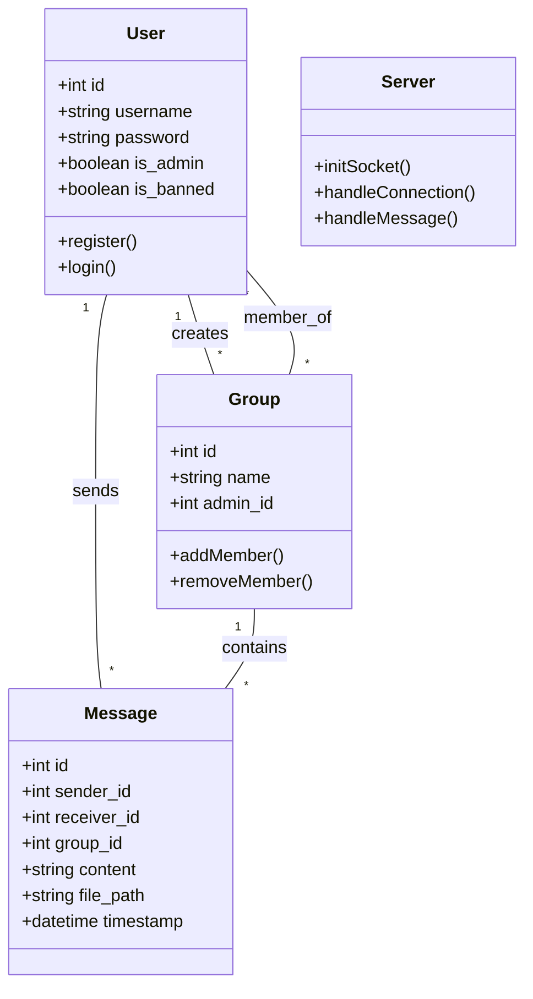
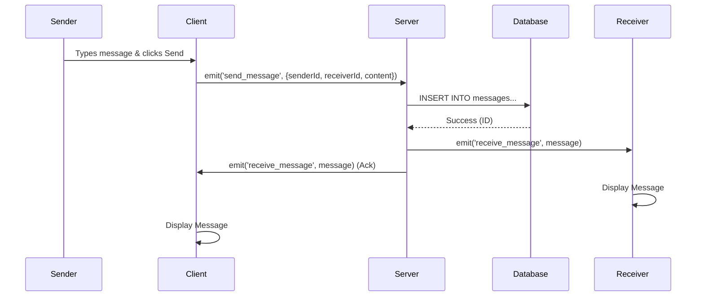
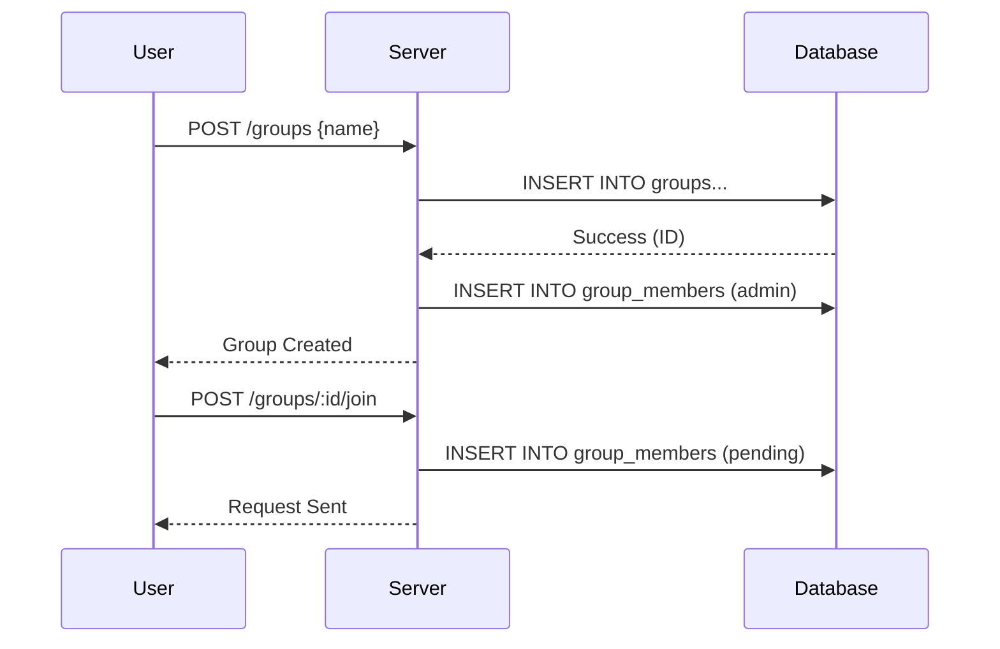

# WhatsUT UML Diagrams

## Use Case Diagram

```mermaid
usecaseDiagram
    actor User
    actor Admin
    
    User <|-- Admin

    package System {
        usecase "Register/Login" as UC1
        usecase "View Online Users" as UC2
        usecase "Create Group" as UC3
        usecase "Join Group" as UC4
        usecase "Private Chat" as UC5
        usecase "Group Chat" as UC6
        usecase "Send File" as UC7
        usecase "Leave Group" as UC8
        usecase "Ban User" as UC9
    }

    User --> UC1
    User --> UC2
    User --> UC3
    User --> UC4
    User --> UC5
    User --> UC6
    User --> UC7
    User --> UC8
    Admin --> UC9
```

## Class Diagram



## Sequence Diagram: Send Private Message



## Sequence Diagram: Group Creation & Join


